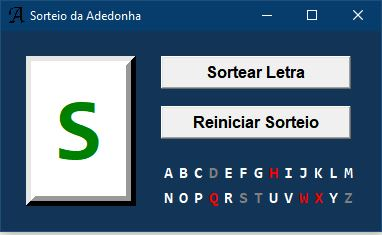

# Sorteador de Letras
Uma interface para sortear letras feita com Python Tkinter.

  

## Instruções 📖
- Para sortear uma letra, aperte o botão "Sortear Letra"
- Para reiniciar o sorteio, aperte o botão "Reiniciar Sorteio"
- Para impedir que uma letra seja sorteada, clique na letra desejada

## Legenda 👁‍🗨
- **Letras brancas**: letras que ainda vão ser sorteadas.
- **Letras cinzas**: letras já sorteadas.
- **Letras vermelhas**: letras retiradas do sorteio. 

## Como abrir pelo Terminal? 👨‍💻

Primeiramente, você deverá [converter o script em um executável](https://github.com/VLRTroll/Mastermind-Prompt-Game#see-more). Depois disso basta seguir as intruções, [clicando aqui](https://github.com/VLRTroll/Mastermind-Prompt-Game#including-the-game-into-your-terminal-windows).

---

Made with ❤️ by <strong>VLRTroll :alien: 

